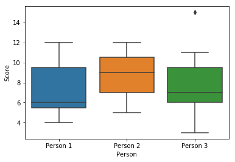

# Pandas Deep Dive by Dmitry Zarubin
The purpose of this introduction is to give an idea about the some tricks and methods of Pandas library.

## Creating DataFrames


```python
import pandas as pd
import seaborn as sns
import numpy as np
from sklearn.datasets import load_iris
```

Pandas Data Structures:

A *Series* is a one-dimensional array object, which contains containing an data of any NumPy data type. It also has  an associated array of data labels, called its index.    

A *DataFrame* represents a spreadsheet-like data structure, which contains a collection of columns. Each column can be of a different value type e.g. string, numeric, boolean. You can think of it as a Dictionary of Series

Let's load a toy dataset


```python
iris = load_iris()
iris_df = pd.DataFrame(data = iris.data, columns=iris.feature_names)
iris_df.head()
```


<div>
<style scoped>
    .dataframe tbody tr th:only-of-type {
        vertical-align: middle;
    }

    .dataframe tbody tr th {
        vertical-align: top;
    }

    .dataframe thead th {
        text-align: right;
    }
</style>
<table border="1" class="dataframe">
  <thead>
    <tr style="text-align: right;">
      <th></th>
      <th>sepal length (cm)</th>
      <th>sepal width (cm)</th>
      <th>petal length (cm)</th>
      <th>petal width (cm)</th>
    </tr>
  </thead>
  <tbody>
    <tr>
      <th>0</th>
      <td>5.1</td>
      <td>3.5</td>
      <td>1.4</td>
      <td>0.2</td>
    </tr>
    <tr>
      <th>1</th>
      <td>4.9</td>
      <td>3.0</td>
      <td>1.4</td>
      <td>0.2</td>
    </tr>
    <tr>
      <th>2</th>
      <td>4.7</td>
      <td>3.2</td>
      <td>1.3</td>
      <td>0.2</td>
    </tr>
    <tr>
      <th>3</th>
      <td>4.6</td>
      <td>3.1</td>
      <td>1.5</td>
      <td>0.2</td>
    </tr>
    <tr>
      <th>4</th>
      <td>5.0</td>
      <td>3.6</td>
      <td>1.4</td>
      <td>0.2</td>
    </tr>
  </tbody>
</table>
</div>


```python
print(type(iris.data)) # the source can be numpy array
```

    <class 'numpy.ndarray'>
    


```python
my_dict = {'a':1,'b':2}
df = pd.DataFrame.from_dict(data=my_dict, orient = 'index',columns =['value']) # or a dictionary
df
```


<div>
<style scoped>
    .dataframe tbody tr th:only-of-type {
        vertical-align: middle;
    }

    .dataframe tbody tr th {
        vertical-align: top;
    }

    .dataframe thead th {
        text-align: right;
    }
</style>
<table border="1" class="dataframe">
  <thead>
    <tr style="text-align: right;">
      <th></th>
      <th>value</th>
    </tr>
  </thead>
  <tbody>
    <tr>
      <th>a</th>
      <td>1</td>
    </tr>
    <tr>
      <th>b</th>
      <td>2</td>
    </tr>
  </tbody>
</table>
</div>


```python
my_list = [['a','b',55]]*4
df = pd.DataFrame(data=my_list, columns =['value1','value2','value3']) # or a list
df
```


<div>
<style scoped>
    .dataframe tbody tr th:only-of-type {
        vertical-align: middle;
    }

    .dataframe tbody tr th {
        vertical-align: top;
    }

    .dataframe thead th {
        text-align: right;
    }
</style>
<table border="1" class="dataframe">
  <thead>
    <tr style="text-align: right;">
      <th></th>
      <th>value1</th>
      <th>value2</th>
      <th>value3</th>
    </tr>
  </thead>
  <tbody>
    <tr>
      <th>0</th>
      <td>a</td>
      <td>b</td>
      <td>55</td>
    </tr>
    <tr>
      <th>1</th>
      <td>a</td>
      <td>b</td>
      <td>55</td>
    </tr>
    <tr>
      <th>2</th>
      <td>a</td>
      <td>b</td>
      <td>55</td>
    </tr>
    <tr>
      <th>3</th>
      <td>a</td>
      <td>b</td>
      <td>55</td>
    </tr>
  </tbody>
</table>
</div>


## Map and Apply

The APPLY method is used to call custom functions on a DataFrame.

We strongly recommend to avoid using iterators over rows and rather employ MAP and APPLY methods. Map works only for a single column (pd.Series), whereas APPLY can be used for the whole dataframe, e.g. when you want change a value in one column based on a value from another column.


```python
iris_df['sepal length (cm)'] = iris_df['sepal length (cm)'].map(lambda x: 2*x)
iris_df['sepal width (cm)'] = iris_df['sepal width (cm)'].map(lambda x: str(x)+' cm' )
iris_df.head() 
```


<div>
<style scoped>
    .dataframe tbody tr th:only-of-type {
        vertical-align: middle;
    }

    .dataframe tbody tr th {
        vertical-align: top;
    }

    .dataframe thead th {
        text-align: right;
    }
</style>
<table border="1" class="dataframe">
  <thead>
    <tr style="text-align: right;">
      <th></th>
      <th>sepal length (cm)</th>
      <th>sepal width (cm)</th>
      <th>petal length (cm)</th>
      <th>petal width (cm)</th>
    </tr>
  </thead>
  <tbody>
    <tr>
      <th>0</th>
      <td>10.2</td>
      <td>3.5 cm</td>
      <td>1.4</td>
      <td>0.2</td>
    </tr>
    <tr>
      <th>1</th>
      <td>9.8</td>
      <td>3.0 cm</td>
      <td>1.4</td>
      <td>0.2</td>
    </tr>
    <tr>
      <th>2</th>
      <td>9.4</td>
      <td>3.2 cm</td>
      <td>1.3</td>
      <td>0.2</td>
    </tr>
    <tr>
      <th>3</th>
      <td>9.2</td>
      <td>3.1 cm</td>
      <td>1.5</td>
      <td>0.2</td>
    </tr>
    <tr>
      <th>4</th>
      <td>10.0</td>
      <td>3.6 cm</td>
      <td>1.4</td>
      <td>0.2</td>
    </tr>
  </tbody>
</table>
</div>


```python
iris_df['condition'] = iris_df.apply( lambda row: row['petal length (cm)'] 
                                               if row['sepal length (cm)']>9.4 else np.nan,axis =1) 
#axis =1 apply function to each row
iris_df.head()
```


<div>
<style scoped>
    .dataframe tbody tr th:only-of-type {
        vertical-align: middle;
    }

    .dataframe tbody tr th {
        vertical-align: top;
    }

    .dataframe thead th {
        text-align: right;
    }
</style>
<table border="1" class="dataframe">
  <thead>
    <tr style="text-align: right;">
      <th></th>
      <th>sepal length (cm)</th>
      <th>sepal width (cm)</th>
      <th>petal length (cm)</th>
      <th>petal width (cm)</th>
      <th>condition</th>
    </tr>
  </thead>
  <tbody>
    <tr>
      <th>0</th>
      <td>10.2</td>
      <td>3.5 cm</td>
      <td>1.4</td>
      <td>0.2</td>
      <td>1.4</td>
    </tr>
    <tr>
      <th>1</th>
      <td>9.8</td>
      <td>3.0 cm</td>
      <td>1.4</td>
      <td>0.2</td>
      <td>1.4</td>
    </tr>
    <tr>
      <th>2</th>
      <td>9.4</td>
      <td>3.2 cm</td>
      <td>1.3</td>
      <td>0.2</td>
      <td>NaN</td>
    </tr>
    <tr>
      <th>3</th>
      <td>9.2</td>
      <td>3.1 cm</td>
      <td>1.5</td>
      <td>0.2</td>
      <td>NaN</td>
    </tr>
    <tr>
      <th>4</th>
      <td>10.0</td>
      <td>3.6 cm</td>
      <td>1.4</td>
      <td>0.2</td>
      <td>1.4</td>
    </tr>
  </tbody>
</table>
</div>


There are other useful methods e.g. fillna, replace, min, max, unique etc. which can be used both for Series and DataFrame objects

## Merge and Append

There are few tools for combining two dataframes in Pandas - e.g. merge, join, and concatenate. Concatenation basically glues DataFrames together. Merge function is similar to JOIN function in SQL. There are 4 types of merge available : 'left', 'right', 'outer', 'inner'. Joining is similar to merging but differs in that the join method occurs on the index key instead of the column. 


```python
# Merge two DF
iris_target = pd.DataFrame(data = iris.target, columns=['class'])
iris_target['class'] = iris_target['class'].map(lambda x: iris.target_names[x])
print(iris_target.head())
#iris_merged = iris_df.merge(iris_target,how = 'inner',right_index= True, left_index=True)
iris_merged = iris_df.join(iris_target,how = 'inner')
iris_merged
```

        class
    0  setosa
    1  setosa
    2  setosa
    3  setosa
    4  setosa
    


<div>
<style scoped>
    .dataframe tbody tr th:only-of-type {
        vertical-align: middle;
    }

    .dataframe tbody tr th {
        vertical-align: top;
    }

    .dataframe thead th {
        text-align: right;
    }
</style>
<table border="1" class="dataframe">
  <thead>
    <tr style="text-align: right;">
      <th></th>
      <th>sepal length (cm)</th>
      <th>sepal width (cm)</th>
      <th>petal length (cm)</th>
      <th>petal width (cm)</th>
      <th>condition</th>
      <th>class</th>
    </tr>
  </thead>
  <tbody>
    <tr>
      <th>0</th>
      <td>10.2</td>
      <td>3.5 cm</td>
      <td>1.4</td>
      <td>0.2</td>
      <td>1.4</td>
      <td>setosa</td>
    </tr>
    <tr>
      <th>1</th>
      <td>9.8</td>
      <td>3.0 cm</td>
      <td>1.4</td>
      <td>0.2</td>
      <td>1.4</td>
      <td>setosa</td>
    </tr>
    <tr>
      <th>2</th>
      <td>9.4</td>
      <td>3.2 cm</td>
      <td>1.3</td>
      <td>0.2</td>
      <td>NaN</td>
      <td>setosa</td>
    </tr>
    <tr>
      <th>3</th>
      <td>9.2</td>
      <td>3.1 cm</td>
      <td>1.5</td>
      <td>0.2</td>
      <td>NaN</td>
      <td>setosa</td>
    </tr>
    <tr>
      <th>4</th>
      <td>10.0</td>
      <td>3.6 cm</td>
      <td>1.4</td>
      <td>0.2</td>
      <td>1.4</td>
      <td>setosa</td>
    </tr>
    <tr>
      <th>5</th>
      <td>10.8</td>
      <td>3.9 cm</td>
      <td>1.7</td>
      <td>0.4</td>
      <td>1.7</td>
      <td>setosa</td>
    </tr>
    <tr>
      <th>6</th>
      <td>9.2</td>
      <td>3.4 cm</td>
      <td>1.4</td>
      <td>0.3</td>
      <td>NaN</td>
      <td>setosa</td>
    </tr>
    <tr>
      <th>7</th>
      <td>10.0</td>
      <td>3.4 cm</td>
      <td>1.5</td>
      <td>0.2</td>
      <td>1.5</td>
      <td>setosa</td>
    </tr>
    <tr>
      <th>8</th>
      <td>8.8</td>
      <td>2.9 cm</td>
      <td>1.4</td>
      <td>0.2</td>
      <td>NaN</td>
      <td>setosa</td>
    </tr>
    <tr>
      <th>9</th>
      <td>9.8</td>
      <td>3.1 cm</td>
      <td>1.5</td>
      <td>0.1</td>
      <td>1.5</td>
      <td>setosa</td>
    </tr>
    <tr>
      <th>10</th>
      <td>10.8</td>
      <td>3.7 cm</td>
      <td>1.5</td>
      <td>0.2</td>
      <td>1.5</td>
      <td>setosa</td>
    </tr>
    <tr>
      <th>11</th>
      <td>9.6</td>
      <td>3.4 cm</td>
      <td>1.6</td>
      <td>0.2</td>
      <td>1.6</td>
      <td>setosa</td>
    </tr>
    <tr>
      <th>12</th>
      <td>9.6</td>
      <td>3.0 cm</td>
      <td>1.4</td>
      <td>0.1</td>
      <td>1.4</td>
      <td>setosa</td>
    </tr>
    <tr>
      <th>13</th>
      <td>8.6</td>
      <td>3.0 cm</td>
      <td>1.1</td>
      <td>0.1</td>
      <td>NaN</td>
      <td>setosa</td>
    </tr>
    <tr>
      <th>14</th>
      <td>11.6</td>
      <td>4.0 cm</td>
      <td>1.2</td>
      <td>0.2</td>
      <td>1.2</td>
      <td>setosa</td>
    </tr>
    <tr>
      <th>15</th>
      <td>11.4</td>
      <td>4.4 cm</td>
      <td>1.5</td>
      <td>0.4</td>
      <td>1.5</td>
      <td>setosa</td>
    </tr>
    <tr>
      <th>16</th>
      <td>10.8</td>
      <td>3.9 cm</td>
      <td>1.3</td>
      <td>0.4</td>
      <td>1.3</td>
      <td>setosa</td>
    </tr>
    <tr>
      <th>17</th>
      <td>10.2</td>
      <td>3.5 cm</td>
      <td>1.4</td>
      <td>0.3</td>
      <td>1.4</td>
      <td>setosa</td>
    </tr>
    <tr>
      <th>18</th>
      <td>11.4</td>
      <td>3.8 cm</td>
      <td>1.7</td>
      <td>0.3</td>
      <td>1.7</td>
      <td>setosa</td>
    </tr>
    <tr>
      <th>19</th>
      <td>10.2</td>
      <td>3.8 cm</td>
      <td>1.5</td>
      <td>0.3</td>
      <td>1.5</td>
      <td>setosa</td>
    </tr>
    <tr>
      <th>20</th>
      <td>10.8</td>
      <td>3.4 cm</td>
      <td>1.7</td>
      <td>0.2</td>
      <td>1.7</td>
      <td>setosa</td>
    </tr>
    <tr>
      <th>21</th>
      <td>10.2</td>
      <td>3.7 cm</td>
      <td>1.5</td>
      <td>0.4</td>
      <td>1.5</td>
      <td>setosa</td>
    </tr>
    <tr>
      <th>22</th>
      <td>9.2</td>
      <td>3.6 cm</td>
      <td>1.0</td>
      <td>0.2</td>
      <td>NaN</td>
      <td>setosa</td>
    </tr>
    <tr>
      <th>23</th>
      <td>10.2</td>
      <td>3.3 cm</td>
      <td>1.7</td>
      <td>0.5</td>
      <td>1.7</td>
      <td>setosa</td>
    </tr>
    <tr>
      <th>24</th>
      <td>9.6</td>
      <td>3.4 cm</td>
      <td>1.9</td>
      <td>0.2</td>
      <td>1.9</td>
      <td>setosa</td>
    </tr>
    <tr>
      <th>25</th>
      <td>10.0</td>
      <td>3.0 cm</td>
      <td>1.6</td>
      <td>0.2</td>
      <td>1.6</td>
      <td>setosa</td>
    </tr>
    <tr>
      <th>26</th>
      <td>10.0</td>
      <td>3.4 cm</td>
      <td>1.6</td>
      <td>0.4</td>
      <td>1.6</td>
      <td>setosa</td>
    </tr>
    <tr>
      <th>27</th>
      <td>10.4</td>
      <td>3.5 cm</td>
      <td>1.5</td>
      <td>0.2</td>
      <td>1.5</td>
      <td>setosa</td>
    </tr>
    <tr>
      <th>28</th>
      <td>10.4</td>
      <td>3.4 cm</td>
      <td>1.4</td>
      <td>0.2</td>
      <td>1.4</td>
      <td>setosa</td>
    </tr>
    <tr>
      <th>29</th>
      <td>9.4</td>
      <td>3.2 cm</td>
      <td>1.6</td>
      <td>0.2</td>
      <td>NaN</td>
      <td>setosa</td>
    </tr>
    <tr>
      <th>...</th>
      <td>...</td>
      <td>...</td>
      <td>...</td>
      <td>...</td>
      <td>...</td>
      <td>...</td>
    </tr>
    <tr>
      <th>120</th>
      <td>13.8</td>
      <td>3.2 cm</td>
      <td>5.7</td>
      <td>2.3</td>
      <td>5.7</td>
      <td>virginica</td>
    </tr>
    <tr>
      <th>121</th>
      <td>11.2</td>
      <td>2.8 cm</td>
      <td>4.9</td>
      <td>2.0</td>
      <td>4.9</td>
      <td>virginica</td>
    </tr>
    <tr>
      <th>122</th>
      <td>15.4</td>
      <td>2.8 cm</td>
      <td>6.7</td>
      <td>2.0</td>
      <td>6.7</td>
      <td>virginica</td>
    </tr>
    <tr>
      <th>123</th>
      <td>12.6</td>
      <td>2.7 cm</td>
      <td>4.9</td>
      <td>1.8</td>
      <td>4.9</td>
      <td>virginica</td>
    </tr>
    <tr>
      <th>124</th>
      <td>13.4</td>
      <td>3.3 cm</td>
      <td>5.7</td>
      <td>2.1</td>
      <td>5.7</td>
      <td>virginica</td>
    </tr>
    <tr>
      <th>125</th>
      <td>14.4</td>
      <td>3.2 cm</td>
      <td>6.0</td>
      <td>1.8</td>
      <td>6.0</td>
      <td>virginica</td>
    </tr>
    <tr>
      <th>126</th>
      <td>12.4</td>
      <td>2.8 cm</td>
      <td>4.8</td>
      <td>1.8</td>
      <td>4.8</td>
      <td>virginica</td>
    </tr>
    <tr>
      <th>127</th>
      <td>12.2</td>
      <td>3.0 cm</td>
      <td>4.9</td>
      <td>1.8</td>
      <td>4.9</td>
      <td>virginica</td>
    </tr>
    <tr>
      <th>128</th>
      <td>12.8</td>
      <td>2.8 cm</td>
      <td>5.6</td>
      <td>2.1</td>
      <td>5.6</td>
      <td>virginica</td>
    </tr>
    <tr>
      <th>129</th>
      <td>14.4</td>
      <td>3.0 cm</td>
      <td>5.8</td>
      <td>1.6</td>
      <td>5.8</td>
      <td>virginica</td>
    </tr>
    <tr>
      <th>130</th>
      <td>14.8</td>
      <td>2.8 cm</td>
      <td>6.1</td>
      <td>1.9</td>
      <td>6.1</td>
      <td>virginica</td>
    </tr>
    <tr>
      <th>131</th>
      <td>15.8</td>
      <td>3.8 cm</td>
      <td>6.4</td>
      <td>2.0</td>
      <td>6.4</td>
      <td>virginica</td>
    </tr>
    <tr>
      <th>132</th>
      <td>12.8</td>
      <td>2.8 cm</td>
      <td>5.6</td>
      <td>2.2</td>
      <td>5.6</td>
      <td>virginica</td>
    </tr>
    <tr>
      <th>133</th>
      <td>12.6</td>
      <td>2.8 cm</td>
      <td>5.1</td>
      <td>1.5</td>
      <td>5.1</td>
      <td>virginica</td>
    </tr>
    <tr>
      <th>134</th>
      <td>12.2</td>
      <td>2.6 cm</td>
      <td>5.6</td>
      <td>1.4</td>
      <td>5.6</td>
      <td>virginica</td>
    </tr>
    <tr>
      <th>135</th>
      <td>15.4</td>
      <td>3.0 cm</td>
      <td>6.1</td>
      <td>2.3</td>
      <td>6.1</td>
      <td>virginica</td>
    </tr>
    <tr>
      <th>136</th>
      <td>12.6</td>
      <td>3.4 cm</td>
      <td>5.6</td>
      <td>2.4</td>
      <td>5.6</td>
      <td>virginica</td>
    </tr>
    <tr>
      <th>137</th>
      <td>12.8</td>
      <td>3.1 cm</td>
      <td>5.5</td>
      <td>1.8</td>
      <td>5.5</td>
      <td>virginica</td>
    </tr>
    <tr>
      <th>138</th>
      <td>12.0</td>
      <td>3.0 cm</td>
      <td>4.8</td>
      <td>1.8</td>
      <td>4.8</td>
      <td>virginica</td>
    </tr>
    <tr>
      <th>139</th>
      <td>13.8</td>
      <td>3.1 cm</td>
      <td>5.4</td>
      <td>2.1</td>
      <td>5.4</td>
      <td>virginica</td>
    </tr>
    <tr>
      <th>140</th>
      <td>13.4</td>
      <td>3.1 cm</td>
      <td>5.6</td>
      <td>2.4</td>
      <td>5.6</td>
      <td>virginica</td>
    </tr>
    <tr>
      <th>141</th>
      <td>13.8</td>
      <td>3.1 cm</td>
      <td>5.1</td>
      <td>2.3</td>
      <td>5.1</td>
      <td>virginica</td>
    </tr>
    <tr>
      <th>142</th>
      <td>11.6</td>
      <td>2.7 cm</td>
      <td>5.1</td>
      <td>1.9</td>
      <td>5.1</td>
      <td>virginica</td>
    </tr>
    <tr>
      <th>143</th>
      <td>13.6</td>
      <td>3.2 cm</td>
      <td>5.9</td>
      <td>2.3</td>
      <td>5.9</td>
      <td>virginica</td>
    </tr>
    <tr>
      <th>144</th>
      <td>13.4</td>
      <td>3.3 cm</td>
      <td>5.7</td>
      <td>2.5</td>
      <td>5.7</td>
      <td>virginica</td>
    </tr>
    <tr>
      <th>145</th>
      <td>13.4</td>
      <td>3.0 cm</td>
      <td>5.2</td>
      <td>2.3</td>
      <td>5.2</td>
      <td>virginica</td>
    </tr>
    <tr>
      <th>146</th>
      <td>12.6</td>
      <td>2.5 cm</td>
      <td>5.0</td>
      <td>1.9</td>
      <td>5.0</td>
      <td>virginica</td>
    </tr>
    <tr>
      <th>147</th>
      <td>13.0</td>
      <td>3.0 cm</td>
      <td>5.2</td>
      <td>2.0</td>
      <td>5.2</td>
      <td>virginica</td>
    </tr>
    <tr>
      <th>148</th>
      <td>12.4</td>
      <td>3.4 cm</td>
      <td>5.4</td>
      <td>2.3</td>
      <td>5.4</td>
      <td>virginica</td>
    </tr>
    <tr>
      <th>149</th>
      <td>11.8</td>
      <td>3.0 cm</td>
      <td>5.1</td>
      <td>1.8</td>
      <td>5.1</td>
      <td>virginica</td>
    </tr>
  </tbody>
</table>
<p>150 rows × 6 columns</p>
</div>


APPEND basically is adding one dataframe on top of another while aligning the columns with identical names. In order to append to an empty DF (e.g. in a loop) one has to initialize it with result=pd.DataFrame([])


```python
my_list1 = [['a','b',55]]*4
my_list2 = [['a','b','C',55]]*3
df1 = pd.DataFrame(data=my_list1, columns =['value1','value2','value5'])
df2 = pd.DataFrame(data=my_list2, columns =['value1','value2','value3','value4'])
df1 = df1.append(df2,sort=False)
df1
# one could also use df1.append(df2,ignore_index=True) to create a unique index
```


<div>
<style scoped>
    .dataframe tbody tr th:only-of-type {
        vertical-align: middle;
    }

    .dataframe tbody tr th {
        vertical-align: top;
    }

    .dataframe thead th {
        text-align: right;
    }
</style>
<table border="1" class="dataframe">
  <thead>
    <tr style="text-align: right;">
      <th></th>
      <th>value1</th>
      <th>value2</th>
      <th>value5</th>
      <th>value3</th>
      <th>value4</th>
    </tr>
  </thead>
  <tbody>
    <tr>
      <th>0</th>
      <td>a</td>
      <td>b</td>
      <td>55.0</td>
      <td>NaN</td>
      <td>NaN</td>
    </tr>
    <tr>
      <th>1</th>
      <td>a</td>
      <td>b</td>
      <td>55.0</td>
      <td>NaN</td>
      <td>NaN</td>
    </tr>
    <tr>
      <th>2</th>
      <td>a</td>
      <td>b</td>
      <td>55.0</td>
      <td>NaN</td>
      <td>NaN</td>
    </tr>
    <tr>
      <th>3</th>
      <td>a</td>
      <td>b</td>
      <td>55.0</td>
      <td>NaN</td>
      <td>NaN</td>
    </tr>
    <tr>
      <th>0</th>
      <td>a</td>
      <td>b</td>
      <td>NaN</td>
      <td>C</td>
      <td>55.0</td>
    </tr>
    <tr>
      <th>1</th>
      <td>a</td>
      <td>b</td>
      <td>NaN</td>
      <td>C</td>
      <td>55.0</td>
    </tr>
    <tr>
      <th>2</th>
      <td>a</td>
      <td>b</td>
      <td>NaN</td>
      <td>C</td>
      <td>55.0</td>
    </tr>
  </tbody>
</table>
</div>


## GroupBy

Grouby allows you to group rows together, so that you can use aggregate functions - e.g. sum, mean, standard deviation, count, describe.


```python
print(iris_merged.groupby(['class'])['sepal length (cm)'].mean()) # average for groups
```

    class
    setosa        10.012
    versicolor    11.872
    virginica     13.176
    Name: sepal length (cm), dtype: float64
    


```python
for class_name, df_class in iris_merged.groupby('class'):
    print("for class {0} the minimal sepal length is {1} cm".format(class_name, df_class['sepal length (cm)'].min() ))
```

    for class setosa the minimal sepal length is 8.6 cm
    for class versicolor the minimal sepal length is 9.8 cm
    for class virginica the minimal sepal length is 9.8 cm
    


```python
iris_merged.groupby(['class'])['sepal length (cm)'].mean().reset_index() # to get grouping value as a column
```


<div>
<style scoped>
    .dataframe tbody tr th:only-of-type {
        vertical-align: middle;
    }

    .dataframe tbody tr th {
        vertical-align: top;
    }

    .dataframe thead th {
        text-align: right;
    }
</style>
<table border="1" class="dataframe">
  <thead>
    <tr style="text-align: right;">
      <th></th>
      <th>class</th>
      <th>sepal length (cm)</th>
    </tr>
  </thead>
  <tbody>
    <tr>
      <th>0</th>
      <td>setosa</td>
      <td>10.012</td>
    </tr>
    <tr>
      <th>1</th>
      <td>versicolor</td>
      <td>11.872</td>
    </tr>
    <tr>
      <th>2</th>
      <td>virginica</td>
      <td>13.176</td>
    </tr>
  </tbody>
</table>
</div>


## DateTimeIndex


```python
def get_chunk_by_time(data,start_time,end_time,date_index):
    """
    returns chunk of data from pandas dataframe which is from start_time till end_time,
     the date_index should be Datetime column 
    
    """
    data = data.set_index(pd.DatetimeIndex(data[date_index]))
    return data.between_time( start_time.time(),end_time.time() )
```


```python
# create a new DF with time column
time_range = pd.date_range(start='2018-04-24', end='2018-04-25', periods=7)
df1['time'] = pd.Series(time_range,index = df1.index)
df1
```


<div>
<style scoped>
    .dataframe tbody tr th:only-of-type {
        vertical-align: middle;
    }

    .dataframe tbody tr th {
        vertical-align: top;
    }

    .dataframe thead th {
        text-align: right;
    }
</style>
<table border="1" class="dataframe">
  <thead>
    <tr style="text-align: right;">
      <th></th>
      <th>value1</th>
      <th>value2</th>
      <th>value5</th>
      <th>value3</th>
      <th>value4</th>
      <th>time</th>
    </tr>
  </thead>
  <tbody>
    <tr>
      <th>0</th>
      <td>a</td>
      <td>b</td>
      <td>55.0</td>
      <td>NaN</td>
      <td>NaN</td>
      <td>2018-04-24 00:00:00</td>
    </tr>
    <tr>
      <th>1</th>
      <td>a</td>
      <td>b</td>
      <td>55.0</td>
      <td>NaN</td>
      <td>NaN</td>
      <td>2018-04-24 04:00:00</td>
    </tr>
    <tr>
      <th>2</th>
      <td>a</td>
      <td>b</td>
      <td>55.0</td>
      <td>NaN</td>
      <td>NaN</td>
      <td>2018-04-24 08:00:00</td>
    </tr>
    <tr>
      <th>3</th>
      <td>a</td>
      <td>b</td>
      <td>55.0</td>
      <td>NaN</td>
      <td>NaN</td>
      <td>2018-04-24 12:00:00</td>
    </tr>
    <tr>
      <th>0</th>
      <td>a</td>
      <td>b</td>
      <td>NaN</td>
      <td>C</td>
      <td>55.0</td>
      <td>2018-04-24 16:00:00</td>
    </tr>
    <tr>
      <th>1</th>
      <td>a</td>
      <td>b</td>
      <td>NaN</td>
      <td>C</td>
      <td>55.0</td>
      <td>2018-04-24 20:00:00</td>
    </tr>
    <tr>
      <th>2</th>
      <td>a</td>
      <td>b</td>
      <td>NaN</td>
      <td>C</td>
      <td>55.0</td>
      <td>2018-04-25 00:00:00</td>
    </tr>
  </tbody>
</table>
</div>


```python
print(get_chunk_by_time(df1, pd.to_datetime('2018-04-24 04:00:00'),
                                 pd.to_datetime('2018-04-24 17:00:00'), 'time' ))
```

                        value1 value2  value5 value3  value4                time
    time                                                                        
    2018-04-24 04:00:00      a      b    55.0    NaN     NaN 2018-04-24 04:00:00
    2018-04-24 08:00:00      a      b    55.0    NaN     NaN 2018-04-24 08:00:00
    2018-04-24 12:00:00      a      b    55.0    NaN     NaN 2018-04-24 12:00:00
    2018-04-24 16:00:00      a      b     NaN      C    55.0 2018-04-24 16:00:00
    

Other important time methods are pd.to_datetime() and pd.to_timedelta()

## Melt, Pivot

To get DataFrame from a column (Series) one could use reset_index() method


```python
iris_count = iris_merged['class'].value_counts()
iris_count.reset_index()
```


<div>
<style scoped>
    .dataframe tbody tr th:only-of-type {
        vertical-align: middle;
    }

    .dataframe tbody tr th {
        vertical-align: top;
    }

    .dataframe thead th {
        text-align: right;
    }
</style>
<table border="1" class="dataframe">
  <thead>
    <tr style="text-align: right;">
      <th></th>
      <th>index</th>
      <th>class</th>
    </tr>
  </thead>
  <tbody>
    <tr>
      <th>0</th>
      <td>virginica</td>
      <td>50</td>
    </tr>
    <tr>
      <th>1</th>
      <td>versicolor</td>
      <td>50</td>
    </tr>
    <tr>
      <th>2</th>
      <td>setosa</td>
      <td>50</td>
    </tr>
  </tbody>
</table>
</div>


MELT Unpivots a DataFrame from wide format to long format, optionally leaving identifier variables set. It is useful when you want to have column names as values, e.g. for analysis or plotting


```python
data = {'weekday': ["Monday", "Tuesday", "Wednesday", 
         "Thursday", "Friday", "Saturday", "Sunday"],
        'Person 1': [12, 6, 5, 8, 11, 6, 4],
        'Person 2': [10, 6, 11, 5, 8, 9, 12],
        'Person 3': [8, 5, 7, 3, 7, 11, 15]}
df = pd.DataFrame(data, columns=['weekday',
        'Person 1', 'Person 2', 'Person 3'])
df
```


<div>
<style scoped>
    .dataframe tbody tr th:only-of-type {
        vertical-align: middle;
    }

    .dataframe tbody tr th {
        vertical-align: top;
    }

    .dataframe thead th {
        text-align: right;
    }
</style>
<table border="1" class="dataframe">
  <thead>
    <tr style="text-align: right;">
      <th></th>
      <th>weekday</th>
      <th>Person 1</th>
      <th>Person 2</th>
      <th>Person 3</th>
    </tr>
  </thead>
  <tbody>
    <tr>
      <th>0</th>
      <td>Monday</td>
      <td>12</td>
      <td>10</td>
      <td>8</td>
    </tr>
    <tr>
      <th>1</th>
      <td>Tuesday</td>
      <td>6</td>
      <td>6</td>
      <td>5</td>
    </tr>
    <tr>
      <th>2</th>
      <td>Wednesday</td>
      <td>5</td>
      <td>11</td>
      <td>7</td>
    </tr>
    <tr>
      <th>3</th>
      <td>Thursday</td>
      <td>8</td>
      <td>5</td>
      <td>3</td>
    </tr>
    <tr>
      <th>4</th>
      <td>Friday</td>
      <td>11</td>
      <td>8</td>
      <td>7</td>
    </tr>
    <tr>
      <th>5</th>
      <td>Saturday</td>
      <td>6</td>
      <td>9</td>
      <td>11</td>
    </tr>
    <tr>
      <th>6</th>
      <td>Sunday</td>
      <td>4</td>
      <td>12</td>
      <td>15</td>
    </tr>
  </tbody>
</table>
</div>


```python
melted = pd.melt(df, id_vars=["weekday"], 
                 var_name="Person", value_name="Score")
melted.head(15)
```


<div>
<style scoped>
    .dataframe tbody tr th:only-of-type {
        vertical-align: middle;
    }

    .dataframe tbody tr th {
        vertical-align: top;
    }

    .dataframe thead th {
        text-align: right;
    }
</style>
<table border="1" class="dataframe">
  <thead>
    <tr style="text-align: right;">
      <th></th>
      <th>weekday</th>
      <th>Person</th>
      <th>Score</th>
    </tr>
  </thead>
  <tbody>
    <tr>
      <th>0</th>
      <td>Monday</td>
      <td>Person 1</td>
      <td>12</td>
    </tr>
    <tr>
      <th>1</th>
      <td>Tuesday</td>
      <td>Person 1</td>
      <td>6</td>
    </tr>
    <tr>
      <th>2</th>
      <td>Wednesday</td>
      <td>Person 1</td>
      <td>5</td>
    </tr>
    <tr>
      <th>3</th>
      <td>Thursday</td>
      <td>Person 1</td>
      <td>8</td>
    </tr>
    <tr>
      <th>4</th>
      <td>Friday</td>
      <td>Person 1</td>
      <td>11</td>
    </tr>
    <tr>
      <th>5</th>
      <td>Saturday</td>
      <td>Person 1</td>
      <td>6</td>
    </tr>
    <tr>
      <th>6</th>
      <td>Sunday</td>
      <td>Person 1</td>
      <td>4</td>
    </tr>
    <tr>
      <th>7</th>
      <td>Monday</td>
      <td>Person 2</td>
      <td>10</td>
    </tr>
    <tr>
      <th>8</th>
      <td>Tuesday</td>
      <td>Person 2</td>
      <td>6</td>
    </tr>
    <tr>
      <th>9</th>
      <td>Wednesday</td>
      <td>Person 2</td>
      <td>11</td>
    </tr>
    <tr>
      <th>10</th>
      <td>Thursday</td>
      <td>Person 2</td>
      <td>5</td>
    </tr>
    <tr>
      <th>11</th>
      <td>Friday</td>
      <td>Person 2</td>
      <td>8</td>
    </tr>
    <tr>
      <th>12</th>
      <td>Saturday</td>
      <td>Person 2</td>
      <td>9</td>
    </tr>
    <tr>
      <th>13</th>
      <td>Sunday</td>
      <td>Person 2</td>
      <td>12</td>
    </tr>
    <tr>
      <th>14</th>
      <td>Monday</td>
      <td>Person 3</td>
      <td>8</td>
    </tr>
  </tbody>
</table>
</div>


```python
sns.boxplot(data = melted, x = "Person", y = "Score")
```


    <matplotlib.axes._subplots.AxesSubplot at 0x20bc1fc0a90>





One can produce a “pivot” table based on column values. 


```python
iris_pivot = iris_merged.pivot(columns = 'class')
iris_pivot.head()
#iris_pivot['sepal length (cm)','setosa']
```


<div>
<style scoped>
    .dataframe tbody tr th:only-of-type {
        vertical-align: middle;
    }

    .dataframe tbody tr th {
        vertical-align: top;
    }

    .dataframe thead tr th {
        text-align: left;
    }
</style>
<table border="1" class="dataframe">
  <thead>
    <tr>
      <th></th>
      <th colspan="3" halign="left">sepal length (cm)</th>
      <th colspan="3" halign="left">sepal width (cm)</th>
      <th colspan="3" halign="left">petal length (cm)</th>
      <th colspan="3" halign="left">petal width (cm)</th>
      <th colspan="3" halign="left">condition</th>
    </tr>
    <tr>
      <th>class</th>
      <th>setosa</th>
      <th>versicolor</th>
      <th>virginica</th>
      <th>setosa</th>
      <th>versicolor</th>
      <th>virginica</th>
      <th>setosa</th>
      <th>versicolor</th>
      <th>virginica</th>
      <th>setosa</th>
      <th>versicolor</th>
      <th>virginica</th>
      <th>setosa</th>
      <th>versicolor</th>
      <th>virginica</th>
    </tr>
  </thead>
  <tbody>
    <tr>
      <th>0</th>
      <td>10.2</td>
      <td>NaN</td>
      <td>NaN</td>
      <td>3.5 cm</td>
      <td>NaN</td>
      <td>NaN</td>
      <td>1.4</td>
      <td>NaN</td>
      <td>NaN</td>
      <td>0.2</td>
      <td>NaN</td>
      <td>NaN</td>
      <td>1.4</td>
      <td>NaN</td>
      <td>NaN</td>
    </tr>
    <tr>
      <th>1</th>
      <td>9.8</td>
      <td>NaN</td>
      <td>NaN</td>
      <td>3.0 cm</td>
      <td>NaN</td>
      <td>NaN</td>
      <td>1.4</td>
      <td>NaN</td>
      <td>NaN</td>
      <td>0.2</td>
      <td>NaN</td>
      <td>NaN</td>
      <td>1.4</td>
      <td>NaN</td>
      <td>NaN</td>
    </tr>
    <tr>
      <th>2</th>
      <td>9.4</td>
      <td>NaN</td>
      <td>NaN</td>
      <td>3.2 cm</td>
      <td>NaN</td>
      <td>NaN</td>
      <td>1.3</td>
      <td>NaN</td>
      <td>NaN</td>
      <td>0.2</td>
      <td>NaN</td>
      <td>NaN</td>
      <td>NaN</td>
      <td>NaN</td>
      <td>NaN</td>
    </tr>
    <tr>
      <th>3</th>
      <td>9.2</td>
      <td>NaN</td>
      <td>NaN</td>
      <td>3.1 cm</td>
      <td>NaN</td>
      <td>NaN</td>
      <td>1.5</td>
      <td>NaN</td>
      <td>NaN</td>
      <td>0.2</td>
      <td>NaN</td>
      <td>NaN</td>
      <td>NaN</td>
      <td>NaN</td>
      <td>NaN</td>
    </tr>
    <tr>
      <th>4</th>
      <td>10.0</td>
      <td>NaN</td>
      <td>NaN</td>
      <td>3.6 cm</td>
      <td>NaN</td>
      <td>NaN</td>
      <td>1.4</td>
      <td>NaN</td>
      <td>NaN</td>
      <td>0.2</td>
      <td>NaN</td>
      <td>NaN</td>
      <td>1.4</td>
      <td>NaN</td>
      <td>NaN</td>
    </tr>
  </tbody>
</table>
</div>


We can go back to wide format from melted. In this case MultiIndex has been created


```python
person_pivot = melted.pivot_table(columns = 'Person',index = 'weekday')
person_pivot
```


<div>
<style scoped>
    .dataframe tbody tr th:only-of-type {
        vertical-align: middle;
    }

    .dataframe tbody tr th {
        vertical-align: top;
    }

    .dataframe thead tr th {
        text-align: left;
    }

    .dataframe thead tr:last-of-type th {
        text-align: right;
    }
</style>
<table border="1" class="dataframe">
  <thead>
    <tr>
      <th></th>
      <th colspan="3" halign="left">Score</th>
    </tr>
    <tr>
      <th>Person</th>
      <th>Person 1</th>
      <th>Person 2</th>
      <th>Person 3</th>
    </tr>
    <tr>
      <th>weekday</th>
      <th></th>
      <th></th>
      <th></th>
    </tr>
  </thead>
  <tbody>
    <tr>
      <th>Friday</th>
      <td>11</td>
      <td>8</td>
      <td>7</td>
    </tr>
    <tr>
      <th>Monday</th>
      <td>12</td>
      <td>10</td>
      <td>8</td>
    </tr>
    <tr>
      <th>Saturday</th>
      <td>6</td>
      <td>9</td>
      <td>11</td>
    </tr>
    <tr>
      <th>Sunday</th>
      <td>4</td>
      <td>12</td>
      <td>15</td>
    </tr>
    <tr>
      <th>Thursday</th>
      <td>8</td>
      <td>5</td>
      <td>3</td>
    </tr>
    <tr>
      <th>Tuesday</th>
      <td>6</td>
      <td>6</td>
      <td>5</td>
    </tr>
    <tr>
      <th>Wednesday</th>
      <td>5</td>
      <td>11</td>
      <td>7</td>
    </tr>
  </tbody>
</table>
</div>


```python
type(person_pivot.columns)
```


    pandas.core.indexes.multi.MultiIndex


The following resets our DataFrame index to a column 0..number_of_rows being our new index.


```python
person_pivot.columns = person_pivot.columns.droplevel(level=0)
person_pivot.reset_index()
```


<div>
<style scoped>
    .dataframe tbody tr th:only-of-type {
        vertical-align: middle;
    }

    .dataframe tbody tr th {
        vertical-align: top;
    }

    .dataframe thead th {
        text-align: right;
    }
</style>
<table border="1" class="dataframe">
  <thead>
    <tr style="text-align: right;">
      <th>Person</th>
      <th>weekday</th>
      <th>Person 1</th>
      <th>Person 2</th>
      <th>Person 3</th>
    </tr>
  </thead>
  <tbody>
    <tr>
      <th>0</th>
      <td>Friday</td>
      <td>11</td>
      <td>8</td>
      <td>7</td>
    </tr>
    <tr>
      <th>1</th>
      <td>Monday</td>
      <td>12</td>
      <td>10</td>
      <td>8</td>
    </tr>
    <tr>
      <th>2</th>
      <td>Saturday</td>
      <td>6</td>
      <td>9</td>
      <td>11</td>
    </tr>
    <tr>
      <th>3</th>
      <td>Sunday</td>
      <td>4</td>
      <td>12</td>
      <td>15</td>
    </tr>
    <tr>
      <th>4</th>
      <td>Thursday</td>
      <td>8</td>
      <td>5</td>
      <td>3</td>
    </tr>
    <tr>
      <th>5</th>
      <td>Tuesday</td>
      <td>6</td>
      <td>6</td>
      <td>5</td>
    </tr>
    <tr>
      <th>6</th>
      <td>Wednesday</td>
      <td>5</td>
      <td>11</td>
      <td>7</td>
    </tr>
  </tbody>
</table>
</div>


One could also use set_index or reindex commands.

## Direct access, iloc, values, iterrows (not recommended)

In my experience most of data analysis can be done with MAP,APPLY and GROUPBY. Although there are cases when one would like to directly access values in dataframe. 
In order to get list from dataframe one could use:


```python
df1.values.tolist()
```


    [['a', 'b', 55.0, nan, nan, Timestamp('2018-04-24 00:00:00')],
     ['a', 'b', 55.0, nan, nan, Timestamp('2018-04-24 04:00:00')],
     ['a', 'b', 55.0, nan, nan, Timestamp('2018-04-24 08:00:00')],
     ['a', 'b', 55.0, nan, nan, Timestamp('2018-04-24 12:00:00')],
     ['a', 'b', nan, 'C', 55.0, Timestamp('2018-04-24 16:00:00')],
     ['a', 'b', nan, 'C', 55.0, Timestamp('2018-04-24 20:00:00')],
     ['a', 'b', nan, 'C', 55.0, Timestamp('2018-04-25 00:00:00')]]


```python
idx =df1.loc[df1['value3'].notnull()] # select by condition or labels
idx
```


<div>
<style scoped>
    .dataframe tbody tr th:only-of-type {
        vertical-align: middle;
    }

    .dataframe tbody tr th {
        vertical-align: top;
    }

    .dataframe thead th {
        text-align: right;
    }
</style>
<table border="1" class="dataframe">
  <thead>
    <tr style="text-align: right;">
      <th></th>
      <th>value1</th>
      <th>value2</th>
      <th>value5</th>
      <th>value3</th>
      <th>value4</th>
      <th>time</th>
    </tr>
  </thead>
  <tbody>
    <tr>
      <th>0</th>
      <td>a</td>
      <td>b</td>
      <td>NaN</td>
      <td>C</td>
      <td>55.0</td>
      <td>2018-04-24 16:00:00</td>
    </tr>
    <tr>
      <th>1</th>
      <td>a</td>
      <td>b</td>
      <td>NaN</td>
      <td>C</td>
      <td>55.0</td>
      <td>2018-04-24 20:00:00</td>
    </tr>
    <tr>
      <th>2</th>
      <td>a</td>
      <td>b</td>
      <td>NaN</td>
      <td>C</td>
      <td>55.0</td>
      <td>2018-04-25 00:00:00</td>
    </tr>
  </tbody>
</table>
</div>


```python
df3 = df1[~df1['value3'].isin(['C']) ] # select by condition
df3
```


<div>
<style scoped>
    .dataframe tbody tr th:only-of-type {
        vertical-align: middle;
    }

    .dataframe tbody tr th {
        vertical-align: top;
    }

    .dataframe thead th {
        text-align: right;
    }
</style>
<table border="1" class="dataframe">
  <thead>
    <tr style="text-align: right;">
      <th></th>
      <th>value1</th>
      <th>value2</th>
      <th>value5</th>
      <th>value3</th>
      <th>value4</th>
      <th>time</th>
    </tr>
  </thead>
  <tbody>
    <tr>
      <th>0</th>
      <td>a</td>
      <td>b</td>
      <td>55.0</td>
      <td>NaN</td>
      <td>NaN</td>
      <td>2018-04-24 00:00:00</td>
    </tr>
    <tr>
      <th>1</th>
      <td>a</td>
      <td>b</td>
      <td>55.0</td>
      <td>NaN</td>
      <td>NaN</td>
      <td>2018-04-24 04:00:00</td>
    </tr>
    <tr>
      <th>2</th>
      <td>a</td>
      <td>b</td>
      <td>55.0</td>
      <td>NaN</td>
      <td>NaN</td>
      <td>2018-04-24 08:00:00</td>
    </tr>
    <tr>
      <th>3</th>
      <td>a</td>
      <td>b</td>
      <td>55.0</td>
      <td>NaN</td>
      <td>NaN</td>
      <td>2018-04-24 12:00:00</td>
    </tr>
  </tbody>
</table>
</div>


```python
df1.iloc[:5] # select by row numbers
```


<div>
<style scoped>
    .dataframe tbody tr th:only-of-type {
        vertical-align: middle;
    }

    .dataframe tbody tr th {
        vertical-align: top;
    }

    .dataframe thead th {
        text-align: right;
    }
</style>
<table border="1" class="dataframe">
  <thead>
    <tr style="text-align: right;">
      <th></th>
      <th>value1</th>
      <th>value2</th>
      <th>value5</th>
      <th>value3</th>
      <th>value4</th>
      <th>time</th>
    </tr>
  </thead>
  <tbody>
    <tr>
      <th>0</th>
      <td>a</td>
      <td>b</td>
      <td>55.0</td>
      <td>NaN</td>
      <td>NaN</td>
      <td>2018-04-24 00:00:00</td>
    </tr>
    <tr>
      <th>1</th>
      <td>a</td>
      <td>b</td>
      <td>55.0</td>
      <td>NaN</td>
      <td>NaN</td>
      <td>2018-04-24 04:00:00</td>
    </tr>
    <tr>
      <th>2</th>
      <td>a</td>
      <td>b</td>
      <td>55.0</td>
      <td>NaN</td>
      <td>NaN</td>
      <td>2018-04-24 08:00:00</td>
    </tr>
    <tr>
      <th>3</th>
      <td>a</td>
      <td>b</td>
      <td>55.0</td>
      <td>NaN</td>
      <td>NaN</td>
      <td>2018-04-24 12:00:00</td>
    </tr>
    <tr>
      <th>0</th>
      <td>a</td>
      <td>b</td>
      <td>NaN</td>
      <td>C</td>
      <td>55.0</td>
      <td>2018-04-24 16:00:00</td>
    </tr>
  </tbody>
</table>
</div>


```python
for index,row in df1.iterrows(): # loop through
    print(row['value5'])
```

    55.0
    55.0
    55.0
    55.0
    nan
    nan
    nan
    


```python

```
